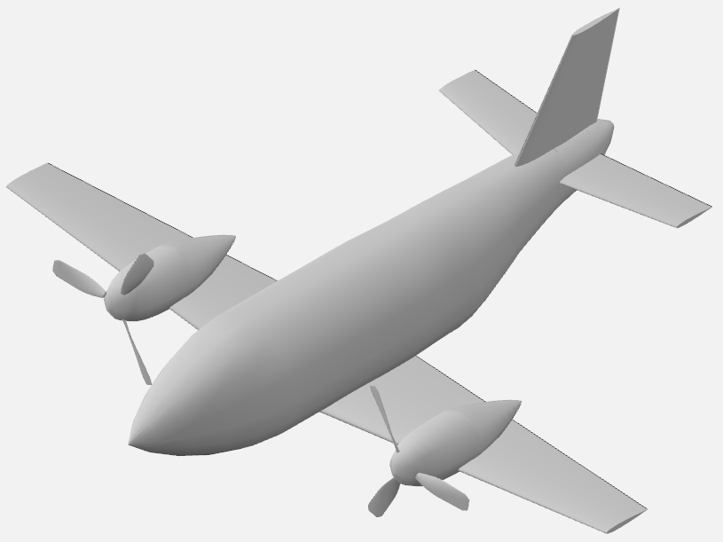

# Aircraft Configuration

Aircraft configuration affects all aspects of performance, size, and weight of an airplane, and hence, should be carefully chosen. The aircraft configuration selection involves determining the type and relative location of major aircraft components such as wing, fuselage, engines, tails, and landing gear. The primary function of the aircraft and the most pressing requirements drive these decisions. Usually, a number of configurations are initially selected, which are then ranked based on some criteria. The best performing configuration is then selected for further analysis. There are different methods for this process such as brainstorming, pugh's method, morphological chart, and weighted objectives. Refer to lecture notes, Chapter 3 from Roskam Part 2, and Chapter 4, 7 and 8 from Raymer for further details. 

For the example airplane, following configuration is selected:

* Low cantilever wing
* Conventional tube fuselage
* Wing mounted engines in tractor configuration
* Conventional tail
* Tricycle landing gear

Below image shows this configuration in OpenVSP:

