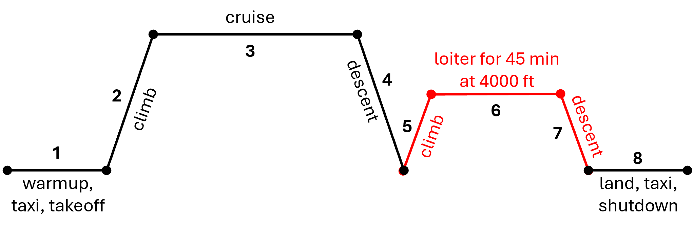

# Example Aircraft

This book uses a twin-engine, propeller driven airplane as an illustrative example 
to demonstrate various aircraft design concepts. This section summarizes preliminary
specifications for this notional aircraft.

> **_NOTE:_** The requirements listed here are not exhaustive. Additional requirements 
> may be introduced in later sections.

**Requirements**:

Requirement | Specification
------- | :-------:
Crew | 1 pilot (200 lbs)                              
Payload | 5 passengers (200 lbs each, including baggage) 
Takeoff and Landing | Maximum 2000 ft (sealevel, standard conditions)
Powerplant | Twin piston engines with propellers
Pressurization | None
Certification | 14 CFR Part 23
Range | 1200 nautical miles
Cruise altitude | 8,000 ft
Cruise speed | 250 KTAS

**Mission Profile**:

Below image depicts the mission profile created using some of the above requirements. Note that
it also includes a reserve mission (red lines) to account for additional fuel according to 14 CFR Part 23.

> **_NOTE:_** These requirements and the associated mission profile are intended solely for
instructional purposes and should not be interpreted as a Request for Proposal (RFP).