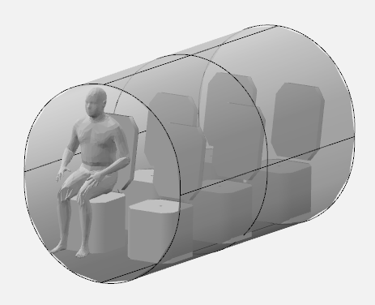

# Fuselage Sizing

Fuselage sizing consists of determining the fuselage length, diameter, cross-sectional shape, aft upsweep angle, and cabin layout details such as seat width, seat pitch, aisle height, aisle width, etc. If desired, structural layout of the fuselage can also be defined. At this stage of the design, these quantities can be determined by looking at what other manufacturers have done. Refer to Chapter 2 in Roskam Part 2, Chapter 3 in Roskam Part 3, Chapter 9 in Raymer, and Chapter 8 in Nicolai & Carichner for more details about fuselage sizing and historical data.

Fuselage produces most amount of drag on an airplane and its shape should be determined to reduce its drag as much as possible. Following parameters govern outer fuselage dimensions:

$$
\begin{aligned}
    \text{Fuselage fineness ratio:} \quad & l_f/l_d, \\
    \text{Aft body fineness ratio:} \quad & l_{fc}/l_d, and \\
    \text{Fuselage upsweep angle:} \quad & \theta_{fc}.
\end{aligned}
$$

The $l_f$ is the fuselag length, $l_d$ is the maximum fuselage diameter, and $l_{fc}$ is the fuselage tail cone length. The fuselage fineness ratio governs the fuselage friction drag, while the profile drag for a fuselage is governed by the aft body fineness ratio. The fuselage upsweep angle also effects the profile drag. Refer to Section 3.1 Roskam Part 3 for a detailed discussion on the affects of various parameters on the fuselage drag. The value of these parameters can be determined so that fuselage's drag decreases. Table 4.1 in Roskam Part 2 provides guidelines for determining these parameters.

Since the cabin does not have to be pressurized, the fuselage cross-section consists of two semi-circles which are connected by two small flat sections (rounded rectanlges with larger corner radius). The fuselage width depends on the cabin width. The example airplane will consists of two abreast seating with three rows - two cockpit seats and four cabin seats. To determine the cabin width, one can look at the cabin layout of the currently available airplanes. Section 3.3 in Roskam Part 3 provides cabin layout for various airplanes. One can also find cabin details in Janes All the World Aircraft book.

The cabin width is usually determined based on the number of seats abreast, seat width, and aisle width. For the example airplane, seat width and height are set to 1.75 ft and 3.5 ft, repsectively, using Table 3.1 in Roskam Part 3. The aisle width is set to 1.25 ft based on Table 9.1 in Raymer. This results in cabin width of 4.75 ft. The cabin height is set to 5 ft based on cabin height of similar airplanes in Fig. 3.49, 3.50, 3.51 in Roskam Part 3 and based on Table 9.1 in Raymer. The seat pitch is determined to be 3 ft based on typical industry practices (Section 3.3.2.2, Roskam Part 3 and Table 9.1 Raymer). 

With the recommended fuselage structural depth of 1.5 in, the fuselage width is 5.0 ft. The fuselage height is set to 5.75 ft, instead of 5.25 ft, to account for the space between the cabin floor and fuselage. The example airplane will consist of a rear door for entry and exit, while the baggage area will be located in the rear of the fuselage. Additionally, one can also determine cabin length using the seat pitch, along with the space for rear door and baggage area. Following table outlines the value of various fusealge variables for the example airplane:

Parameter | Value | Source
------ | :-----: | :----:
Fuselage fineness ratio | 5.5 | Table 4.1 Roskam Part 2, Fig. 3.1 Roskam Part 3
Aft body fineness ratio | 2.5 | Table 4.1 Roskam Part 2, Fig. 3.3 Roskam Part 3
Upsweep angle | $10^{\circ}$ | Table 4.1 Roskam Part 2, Fig. 3.4 Roskam Part 3
Seat pitch | 3 ft | Section 3.3.2.2, Roskam Part 3
Seat height | 3.5 ft | Table 3.1, Roskam Part 3
Seat width | 1.75 ft | Table 3.1, Roskam Part 3
Aisle width | 1.25 ft | Table 9.1, Raymer
Cabin width | 4.75 ft | Calculated
Cabin height | 5 ft | Fig. 3.49, 3.50, 3.51 in Roskam Part 3, Table 9.1 Raymer
Structural depth of fuselage | 1.5 in | Section 4.1, Roskam Part 2
Fuselage width | 5.0 ft | Based on cabin width and structural depth
Fuselage height | 5.75 ft | Based on cabin height, structural depth, allowances
Fuselage length | 31.6 ft | Calculated
Fuselage cone length | 14.4 ft | Calculated

Below image shows fuselage model created in OpenVSP. The box in the rear of the fuselage represents baggage stowing area. The gap between last seating row and baggage area is used for ingress/outgress through rear fuselage door.

> __*NOTE:*__ It is recommended to create simple OpenVSP model as shown above to check if the seat and cabin are of appropriately size. The cabin size will dictate the fuselage width, which in turn will govern the fuselage length.

This concludes the fuselage sizing for initial design. But it can be further refined by including more details about fuselage structural design, refer to Chapter 3 in Roskam Part 3.
